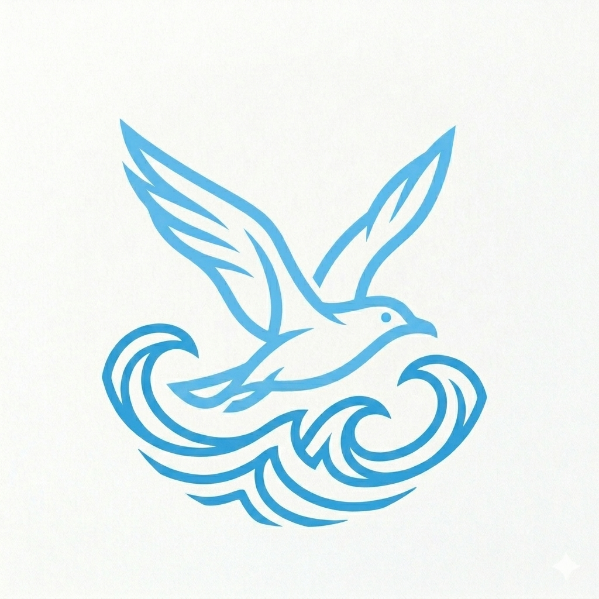
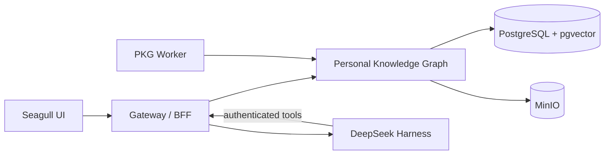

<p align="center">
  
</p>

<h1 align="center">Seagull Knowledge Assistant</h1>

<p align="center">
  Turn scattered information into durable knowledge—and durable knowledge into polished output.
</p>

<p align="center">
  <a href="README.md">English</a> · <a href="README.zh-CN.md">简体中文</a>
</p>

Seagull is a self-hosted knowledge workspace for research, writing, and long-running AI workflows. It collects files and feeds, builds a searchable personal knowledge graph, lets agents work against grounded context, and produces reviewable assets such as articles, briefs, diagrams, and WeChat drafts.

## Why Seagull

- **Capture broadly** — files, web pages, RSS, GitHub, arXiv, papers, and news.
- **Find precisely** — structured filters, vector search, and hybrid retrieval.
- **Work with agents** — reusable Harness presets, skills, tools, sessions, and workflows.
- **Keep humans in control** — agent proposals stay reviewable until explicitly saved or published.
- **Create polished output** — editable Markdown, styled HTML, Mermaid diagrams, downloadable documents, and publishing drafts.

## Architecture



| Service | Responsibility | Port |
| --- | --- | ---: |
| [`personal_knowledge_graph/`](personal_knowledge_graph/) | Durable knowledge, retrieval, assets, connectors, and scheduled jobs | `8000` |
| [`seagull-ui/`](seagull-ui/) | Supported React product interface | `5173` |
| [`bff/`](bff/) | Authentication-aware Gateway for PKG and Harness | `4000` |
| [`deepseek-knowledge-lab/`](deepseek-knowledge-lab/) | Harness profiles, plugins, agent workflows, and experiments | `3080` |

`deepseek-knowledge-lab/dsh-harness` is maintained as a Git submodule.

## Quick Start

### Requirements

- Python 3.12
- Node.js 22+
- Docker with Compose
- Git with submodule support

### Install

```bash
git clone --recurse-submodules https://github.com/CherryYin/seagull-knowledge-assistant.git
cd seagull-knowledge-assistant
./scripts/bootstrap.sh
```

Create local environment files:

```bash
cp personal_knowledge_graph/.env.example personal_knowledge_graph/.env
cp seagull-ui/.env.example seagull-ui/.env
cp bff/.env.example bff/.env
cp deepseek-knowledge-lab/.dsh/.env.example deepseek-knowledge-lab/.dsh/.env
```

Configure the provider keys and secrets you need, then start the platform:

```bash
npm run stack:check
npm run stack:start
```

Open `http://127.0.0.1:5173`.

```bash
npm run stack:status   # inspect services
npm run stack:logs     # follow logs
npm run stack:stop     # stop the platform
npm test               # run repository checks
```

## Design Principles

- PKG owns durable user knowledge; Harness owns agent execution.
- The Gateway owns browser and Harness authentication boundaries.
- Agent output is not persisted without an explicit product action.
- Real `.env` files, credentials, personal content, and runtime state stay local.
- Cross-service contracts evolve together across PKG, Gateway, UI, and Harness plugins.

## Explore Further

- [PKG overview](personal_knowledge_graph/README.md)
- [Platform architecture](docs/platform/architecture.md)
- [Development guide](docs/platform/development.md)
- [Knowledge Lab](deepseek-knowledge-lab/README.md)

## License

Seagull Knowledge Assistant is released under the [MIT License](LICENSE).
