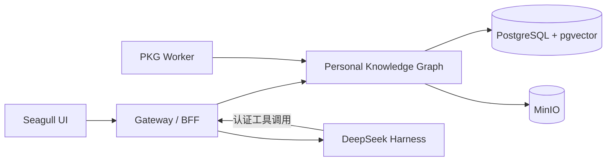

<p align="center">
  
</p>

<h1 align="center">Seagull Knowledge Assistant</h1>

<p align="center">
  让零散信息沉淀为长期知识，再让知识自然流动为优质产物。
</p>

<p align="center">
  <a href="README.md">English</a> · <a href="README.zh-CN.md">简体中文</a>
</p>

Seagull 是一个面向研究、写作与长期 AI 工作流的自托管知识工作台。它可以持续收集文件与信息流，构建可检索的个人知识图谱，让 Agent 基于可靠上下文工作，并生成文章、简报、图表、架构图和微信公众号草稿等可审阅资产。

## 为什么选择 Seagull

- **广泛采集**：文件、网页、RSS、GitHub、arXiv、论文与新闻。
- **精准检索**：结构化过滤、向量搜索与混合检索。
- **Agent 工作流**：可复用的 Harness Preset、Skill、Tool、Session 与 Workflow。
- **人始终可控**：Agent 先提出建议，只有明确确认后才保存或发布。
- **高质量输出**：可编辑 Markdown、精美 HTML、Mermaid 图表、可下载文档与发布草稿。

## 系统架构



| 服务 | 职责 | 端口 |
| --- | --- | ---: |
| [`personal_knowledge_graph/`](personal_knowledge_graph/) | 持久知识、检索、资产、连接器与调度任务 | `8000` |
| [`seagull-ui/`](seagull-ui/) | 正式 React 产品界面 | `5173` |
| [`bff/`](bff/) | 连接 PKG 与 Harness 的认证网关 | `4000` |
| [`deepseek-knowledge-lab/`](deepseek-knowledge-lab/) | Harness 配置、插件、Agent 工作流与实验 | `3080` |

`deepseek-knowledge-lab/dsh-harness` 以 Git submodule 方式维护。

## 快速开始

### 环境要求

- Python 3.12
- Node.js 22+
- Docker + Compose
- 支持 submodule 的 Git

### 安装

```bash
git clone --recurse-submodules https://github.com/CherryYin/seagull-knowledge-assistant.git
cd seagull-knowledge-assistant
./scripts/bootstrap.sh
```

创建本地环境变量文件：

```bash
cp personal_knowledge_graph/.env.example personal_knowledge_graph/.env
cp seagull-ui/.env.example seagull-ui/.env
cp bff/.env.example bff/.env
cp deepseek-knowledge-lab/.dsh/.env.example deepseek-knowledge-lab/.dsh/.env
```

按需配置模型服务密钥和安全参数，然后启动完整平台：

```bash
npm run stack:check
npm run stack:start
```

访问 `http://127.0.0.1:5173`。

```bash
npm run stack:status   # 查看服务状态
npm run stack:logs     # 跟踪日志
npm run stack:stop     # 停止平台
npm test               # 运行仓库检查
```

## 设计原则

- PKG 负责持久化用户知识，Harness 负责 Agent 执行。
- Gateway 负责浏览器与 Harness 的认证边界。
- Agent 输出不会在缺少明确操作时自动写入知识库。
- 真实 `.env`、凭证、个人内容与运行状态只保留在本地。
- PKG、Gateway、UI 与 Harness 插件的跨服务契约保持同步。

## 深入了解

- [PKG 介绍](personal_knowledge_graph/README.zh-CN.md)
- [平台架构](docs/platform/architecture.md)
- [开发指南](docs/platform/development.md)
- [Knowledge Lab](deepseek-knowledge-lab/README.md)

## 开源协议

Seagull Knowledge Assistant 基于 [MIT License](LICENSE) 开源。
