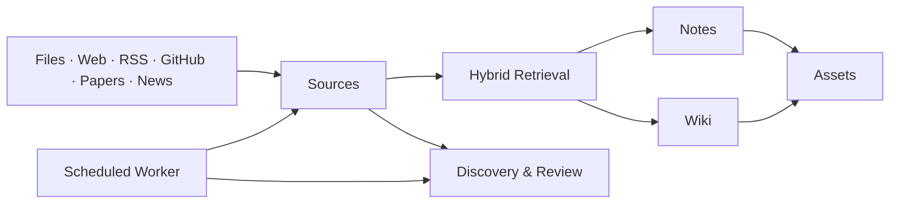

<p align="center">
  
</p>

<h1 align="center">Seagull Personal Knowledge Graph</h1>

<p align="center">
  A durable knowledge backend for collecting, retrieving, connecting, and producing from personal research.
</p>

<p align="center">
  <a href="README.md">English</a> · <a href="README.zh-CN.md">简体中文</a>
</p>

PKG is the knowledge core of Seagull. It turns files, web pages, feeds, repositories, papers, and news into searchable sources; connects them to notes and wiki pages; and supports reviewable assets, discovery, and scheduled automation.

## Knowledge Flow



## What PKG Owns

- **Ingestion** — Markdown, PDF, Office documents, HTML, images, web directories, RSS, GitHub, arXiv, and news.
- **Retrieval** — SQL filtering, embeddings, vector search, hybrid search, and grounded provenance.
- **Knowledge organization** — Sources, Notes, Wiki pages, review suggestions, and discovery candidates.
- **Production records** — Assets, evidence, claims, editable drafts, exports, and publishing metadata.
- **Automation** — background processing, connector trends, paper discovery, news collection, cleanup, and observable system jobs.

PKG stores durable user knowledge. Interactive agent sessions, presets, skills, and execution traces belong to DeepSeek Harness. The supported browser application is [`../seagull-ui`](../seagull-ui/).

## Stack

| Area | Technology |
| --- | --- |
| API | FastAPI + Uvicorn |
| Persistence | PostgreSQL + pgvector, SQLAlchemy, Alembic |
| Retrieval | Structured, vector, and hybrid search |
| Files | MinIO / S3-compatible storage |
| Parsing | Docling, OCR, Trafilatura |
| Providers | OpenAI-compatible APIs, Qwen, MiniMax, Azure OpenAI, Tavily, NewsAPI, OpenAlex, Semantic Scholar |
| Tests | Pytest |

## Quick Start

### 1. Start PostgreSQL and MinIO

```bash
docker compose up -d
```

Default endpoints:

- PostgreSQL: `localhost:5433`
- MinIO API: `http://127.0.0.1:9000`
- MinIO Console: `http://127.0.0.1:9001`

### 2. Install PKG

```bash
python3 -m venv .venv
source .venv/bin/activate
pip install -e ".[dev]"
```

### 3. Configure and migrate

```bash
cp .env.example .env
alembic upgrade head
```

At minimum, review the database, JWT, admin password, MinIO, embedding, and provider settings in `.env`. Never commit the real file.

### 4. Run API and Worker

```bash
pkg serve
```

In another terminal:

```bash
pkg worker
```

The API is available at `http://127.0.0.1:8000`; interactive API docs are at `/docs`.

For the complete UI + Gateway + Harness platform, use the commands in the [workspace README](../README.md).

## Main API Areas

| Area | Routes |
| --- | --- |
| Knowledge | `/sources`, `/notes`, `/wiki`, `/search` |
| Production | `/assets`, `/action/complete` |
| Discovery | `/discovery`, `/paper-discovery`, `/review` |
| Collection | `/connectors`, RSS and web-directory endpoints |
| Operations | `/system/jobs`, `/models`, `/auth` |

## Development

```bash
.venv/bin/python -m pytest
.venv/bin/python -m pytest tests/test_scheduler.py -q
alembic upgrade head
```

Important modules:

- `src/pkg/api/` — FastAPI routes and contracts
- `src/pkg/services/foundation/` — retrieval, parsing, providers, and connectors
- `src/pkg/services/application/` — product use cases and orchestration
- `src/pkg/services/cross_cutting/scheduler.py` — scheduled automation
- `src/pkg/models/` — durable domain and persistence models

When an API contract changes, update the Gateway, Seagull UI, and Harness plugins where applicable.

## License

PKG is part of Seagull Knowledge Assistant and is released under the [MIT License](../LICENSE).
