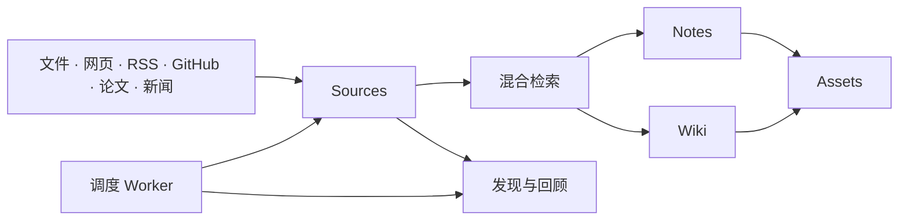

<p align="center">
  
</p>

<h1 align="center">Seagull Personal Knowledge Graph</h1>

<p align="center">
  面向个人研究的持久知识后端：采集、检索、连接知识，并持续生成高质量产物。
</p>

<p align="center">
  <a href="README.md">English</a> · <a href="README.zh-CN.md">简体中文</a>
</p>

PKG 是 Seagull 的知识核心。它把文件、网页、信息流、代码仓库、论文和新闻转化为可检索的 Sources，进一步连接 Notes 与 Wiki，并为知识发现、内容资产和定时自动化提供可靠底座。

## 知识流动



## PKG 负责什么

- **资料采集**：Markdown、PDF、Office 文档、HTML、图片、网页目录、RSS、GitHub、arXiv 与新闻。
- **知识检索**：SQL 过滤、Embedding、向量搜索、混合检索与来源追踪。
- **知识组织**：Sources、Notes、Wiki、回顾建议与发现候选。
- **内容生产记录**：Assets、Evidence、Claims、可编辑草稿、导出与发布元数据。
- **自动化任务**：后台处理、连接器趋势、论文发现、新闻采集、清理任务与 System Jobs 观测。

PKG 只负责持久化用户知识。交互式 Agent Session、Preset、Skill 与执行轨迹由 DeepSeek Harness 管理；正式浏览器产品位于 [`../seagull-ui`](../seagull-ui/)。

## 技术栈

| 领域 | 技术 |
| --- | --- |
| API | FastAPI + Uvicorn |
| 持久化 | PostgreSQL + pgvector、SQLAlchemy、Alembic |
| 检索 | 结构化、向量与混合检索 |
| 文件存储 | MinIO / S3-compatible storage |
| 内容解析 | Docling、OCR、Trafilatura |
| 外部服务 | OpenAI-compatible API、Qwen、MiniMax、Azure OpenAI、Tavily、NewsAPI、OpenAlex、Semantic Scholar |
| 测试 | Pytest |

## 快速开始

### 1. 启动 PostgreSQL 与 MinIO

```bash
docker compose up -d
```

默认地址：

- PostgreSQL：`localhost:5433`
- MinIO API：`http://127.0.0.1:9000`
- MinIO Console：`http://127.0.0.1:9001`

### 2. 安装 PKG

```bash
python3 -m venv .venv
source .venv/bin/activate
pip install -e ".[dev]"
```

### 3. 配置并迁移数据库

```bash
cp .env.example .env
alembic upgrade head
```

至少检查 `.env` 中的数据库、JWT、管理员密码、MinIO、Embedding 与模型服务配置。不要提交真实 `.env`。

### 4. 启动 API 与 Worker

```bash
pkg serve
```

在另一个终端启动周期任务：

```bash
pkg worker
```

API 默认位于 `http://127.0.0.1:8000`，交互式接口文档位于 `/docs`。

如需运行 UI、Gateway 与 Harness，请使用[根仓库 README](../README.zh-CN.md)中的完整平台命令。

## 主要 API

| 领域 | 路由 |
| --- | --- |
| 知识 | `/sources`、`/notes`、`/wiki`、`/search` |
| 生产 | `/assets`、`/action/complete` |
| 发现 | `/discovery`、`/paper-discovery`、`/review` |
| 采集 | `/connectors`、RSS 与网页目录相关接口 |
| 运维 | `/system/jobs`、`/models`、`/auth` |

## 开发

```bash
.venv/bin/python -m pytest
.venv/bin/python -m pytest tests/test_scheduler.py -q
alembic upgrade head
```

关键模块：

- `src/pkg/api/`：FastAPI 路由与接口契约
- `src/pkg/services/foundation/`：检索、解析、Provider 与连接器
- `src/pkg/services/application/`：产品用例与业务编排
- `src/pkg/services/cross_cutting/scheduler.py`：定时自动化
- `src/pkg/models/`：持久领域模型与数据库模型

API 契约发生变化时，请同步更新 Gateway、Seagull UI 与相关 Harness 插件。

## 开源协议

PKG 是 Seagull Knowledge Assistant 的组成部分，基于 [MIT License](../LICENSE) 开源。
