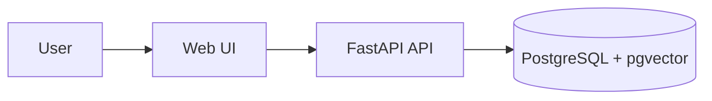
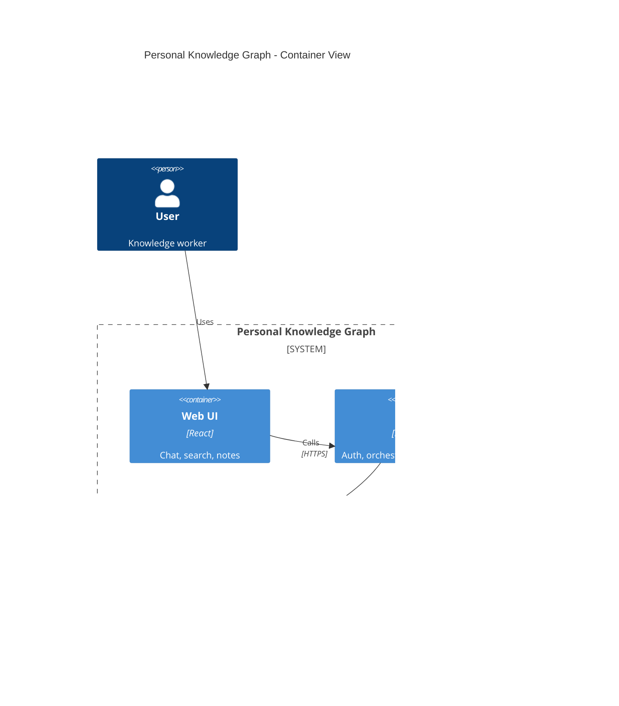
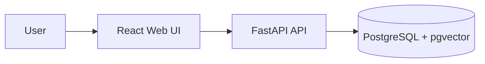

Use this skill to turn architecture or system-design requests into precise, readable Mermaid/C4 diagrams plus a short explanation.

## Output Contract

- Prefer Markdown fenced code blocks using `mermaid`.
- Use Mermaid C4 syntax (`C4Context`, `C4Container`, `C4Component`, `C4Deployment`) only when the user asks for C4-style diagrams; otherwise prefer `flowchart`, which is more portable.
- The first non-empty line inside a Mermaid block must be a valid Mermaid diagram keyword such as `flowchart LR`, `graph TD`, `sequenceDiagram`, or `C4Container`. Never start a Mermaid block with a plain title like `Ingestion Pipeline`.
- Put titles outside the code block as Markdown headings, or use Mermaid's supported title syntax only for diagram types known to accept it.
- Do **not** generate long standalone HTML unless the user explicitly asks for an exportable HTML artifact.
- Keep output concise enough to paste into notes, chat, or technical docs.
- The frontend renderer supports Mermaid/C4 preview and SVG/PNG download after rendering.

## Workflow

1. Clarify the diagram goal from the request:
   - **Context / C4 L1**: actors, external systems, product boundary.
   - **Container / C4 L2**: apps, services, databases, queues, object storage, external APIs.
   - **Component / C4 L3**: modules inside one service.
   - **Sequence**: runtime call flow, agent/tool loop, API request lifecycle.
   - **Data flow**: ingestion, transformation, retrieval, persistence.
   - **Deployment**: runtime nodes, networks, infra, environments.
2. Inspect relevant repo docs/code when the request depends on the current project.
3. Keep diagrams focused: 5–12 nodes for high-level diagrams; split into multiple diagrams if crowded.
4. Label edges with meaningful verbs or data names, not generic arrows.
5. After the diagram, add a concise explanation of responsibilities and flow.

## Mermaid Defaults

Use these diagram types:

- `flowchart LR` for architecture, containers, data flow, and dependency maps.
- `graph TD` when vertical hierarchy is clearer than left-to-right flow.
- `sequenceDiagram` for interactions over time.
- `C4Context` / `C4Container` / `C4Component` for C4-style diagrams. Mermaid 11.15 C4 syntax is strict: put declarations on their own lines, avoid semicolons, and use simple quoted strings.
- `architecture-beta` only when the user specifically wants Mermaid architecture icon/group syntax.

## Style Rules

- Name nodes as concrete system parts: `React Web UI`, `FastAPI API`, `PostgreSQL + pgvector`, `MinIO`, `Action Agent`, `RetrieverAgent`.
- Group bounded areas with `subgraph`, such as `Frontend`, `Backend`, `Storage`, `External Services`.
- Mark ownership/boundaries explicitly when relevant: browser, backend, database, object storage, LLM provider, payment provider.
- Use stable IDs and readable labels: `api[FastAPI API]`, not anonymous nodes.
- Avoid decorative complexity unless the user asks for presentation polish.
- Prefer semantic grouping and readable flow over exhaustive implementation detail.

## Output Pattern

Use a Markdown heading for the diagram title, then start the code block directly with the Mermaid diagram type:

### Ingestion Pipeline

Then provide:

- **Purpose**: what the diagram shows.
- **Key flow**: the 3–5 most important steps.
- **Notes**: assumptions, omissions, or suggested follow-up diagrams.

## C4 Example

If a Mermaid C4 diagram reports `Syntax error in text`, fall back to this portable form:

## When Information Is Missing

Make reasonable assumptions for low-risk details, and state them under **Notes**. Ask a brief clarifying question only when the diagram would be misleading without the answer.

---

**User's request**: $@
